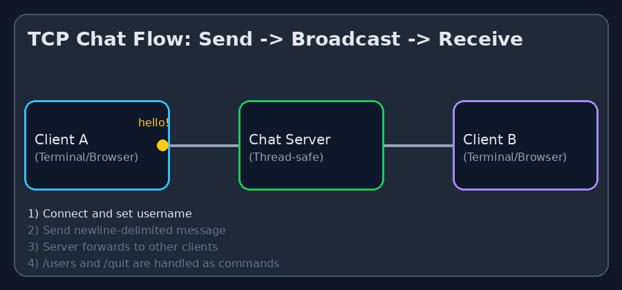
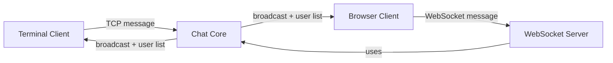

<div align="center">

# 🚀 TCP Chat Server (Animated Guide)

<p>
  
</p>

</div>

A real-time chat application with:
- **C++ TCP server** (multi-client, thread-per-connection)
- **WebSocket server** using `libwebsockets`
- **Modern browser UI** (`web/index.html`)

---

## 🎬 How it works (animated)

<p align="center">
  
</p>

The flow is:
1. Client connects and sends username.
2. Messages are sent as newline-delimited frames.
3. Server broadcasts to all other connected clients.
4. Commands like `/users` and `/quit` are handled server-side.

---

## 🧠 Architecture



### Main components
- `src/server.cpp`
  - TCP chat server (socket accept loop, thread-per-client).
- `src/client.cpp`
  - CLI client for terminal chat.
- `src/chat_server.cpp`
  - Shared thread-safe client registry + user list logic.
- `src/websocket_server.cpp`
  - WebSocket + HTTP server serving browser chat UI.
- `web/index.html`
  - Frontend chat experience.

---

## ✨ Features

- Multi-client real-time chat
- Join/leave notifications
- Thread-safe client management (`std::mutex`)
- Command support:
  - `/users` → list connected users
  - `/quit` → disconnect cleanly
- Browser UI with live message feed and user sidebar

---

## 🛠️ Run with Docker (recommended)

From repository root:

```bash
docker build -t tcp-chat-server .
docker run --rm -p 8081:8081 tcp-chat-server
```

Then open: **http://localhost:8081**

---

## 🧪 Local build (without Docker)

Install dependencies (Ubuntu/Debian):

```bash
sudo apt-get update
sudo apt-get install -y g++ libwebsockets-dev
```

Build WebSocket server:

```bash
g++ -std=c++17 \
  -Iinclude \
  src/websocket_server.cpp \
  src/chat_server.cpp \
  -lwebsockets \
  -o server
```

Run:

```bash
./server
```

Open browser at `http://localhost:8081`.

---

## 💬 TCP-only mode (terminal)

Build TCP server and CLI client:

```bash
g++ -std=c++17 src/server.cpp -o tcp_server
g++ -std=c++17 src/client.cpp -o tcp_client
```

In terminal 1:

```bash
./tcp_server
```

In terminal 2+:

```bash
./tcp_client
```

---

## 📌 Notes

- Default TCP port in `server.cpp`: `8080`
- Default WebSocket/HTTP port in `websocket_server.cpp`: `8081` (or `PORT` env var)
- The CLI client currently targets a fixed IP in `client.cpp`; change it to your server host when testing across machines.
